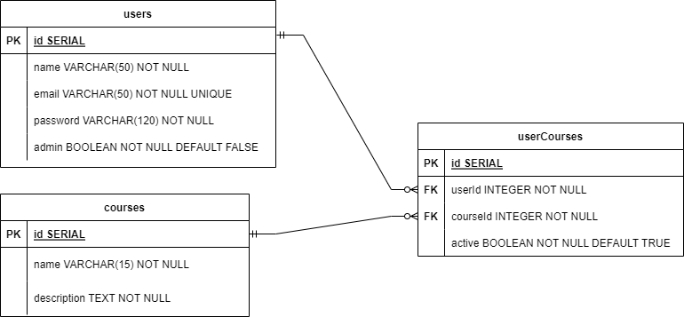

<h1 align="center">
  Courses Control - API
</h1>

<h3 align="center">
  A URL base da api é: X
</h3>

## Visão Geral

Essa aplicação é um MVP de uma API REST que faz o controle de usuários e cursos em que esses usuários serão matriculados. Com ela é póssível ter um controle de acessos, onde alguns recursos podem ser acessados apenas por usuários que fizeram login na aplicação, e outros recursos apenas usuários que fizeram login e tem permissões de administrador podem acessar.

## :hammer: Funcionalidades do projeto:
- CRUD de usuários
- Criação de cursos
- Tokenização, autenticação e proteção de rotas
- Serialização de dados
- Matricular usuário em um dado curso
- Testes automatizados: Unitários e de integração.

## Tecnologias utilizadas:
- Node.js
- Express
- Typescript
- PostgreSQL
- Zod
- Dotenv
- Bcryptjs
- Jsonwebtoken
- Jest e supertest

## **Tabelas do banco de dados**

<div align="center">
  
</div>


<h2 align ='center'> ROTAS DE USUÁRIO </h2>

### **/users**

| Método | Endpoint           | Responsabilidade                              |
| ------ | ------------------ | --------------------------------------------- |
| POST   | /users             | Cadastrar um novo usuário                     |
| GET    | /users             | Listar todos os usuários                      |
| GET    | /users/:id/courses | Listar todos os cursos de um usuário          |


### **POST /users**


- Rota para criação de usuário com os seguintes dados:  
  - **name**: string, campo obrigatório.
  - **email**: string, campo obrigatório e único. Onde não pode ser cadastrados dois usuários com o mesmo **e-mail**.
  - **password**: string, campo obrigatório.
  - **admin**: booleano, opcional.


#### CORPO DA REQUISIÇÃO:

```json
// Cadastrando com admin igual a true
{
    "name": "Ugo",
    "email": "ugo@mail.com.br",
    "password": "1234",
    "admin": true
}

// Cadastrando com admin igual a false ou sem enviar o campo de admin
{
    "name": "Ugo",
    "email": "ugo@mail.com.br",
    "password": "1234"
}
```

#### FORMATO DA RESPOSTA


##### USUÁRIO CRIADO COM SUCESSO: STATUS 201

```json
//Retorno ao enviar o campo de admin igual a true
{
    "id": 1,
    "name": "Ugo",
    "email": "ugo@mail.com.br",
    "admin": true
}

//Retoro ao enviar o campo de admin igual a false ou não enviar o campo de admin
{
    "id": 1,
    "name": "Ugo",
    "email": "ugo@mail.com.br",
    "admin": false
}
```

##### E-MAIL JÁ CADASTRADO: STATUS 409

```json
{
  "message": "Email already registered"
}
```

##### TENTANDO CADASTRAR COM UM BODY INVÁLIDO: STATUS 400

```json
// Cadastrando usuário sem email, sem o nome e com password no formato de número
{
  "email": "ugo",
  "password": 1234,
  "admin": true
}
```

```json
{
  "name": ["Required"],
  "email": ["Invalid email"],
  "password": ["Expected string, received number"]
}
```


#

### **GET /users**


- Rota responsável por listar todos os usuários.  

> [!IMPORTANT]
> É necessário enviar o **Bearer token** no Header dessa requisição.  
> Apenas usuários logados e que são admin devem tem permissão de acessar essa rota.  


#### FORMATO DA RESPOSTA


##### LISTAGEM COM SUCESSO: STATUS 200

```json
[
  {
    "id": 1,
    "name": "Ugo",
    "email": "ugo@mail.com.br",
    "admin": true
  },
  {
    "id": 2,
    "name": "Lucas",
    "email": "lucas@mail.com.br",
    "admin": false
  }
]
```

##### REQUISIÇÃO SEM O TOKEN: STATUS 401

```json
{
  "message": "Missing bearer token"
}
```

##### REQUISIÇÃO COM TOKEN INVÁLIDO: STATUS 401

```json
{
  "message": "jwt must be provided"
}
```

##### REQUISIÇÃO COM O TOKEN, MAS SEM SER DE ADMIN: STATUS 403

```json
{
  "message": "Insufficient permission"
}
```

#

### **GET - /users/:id/courses**


- Com essa rota é possível listar todos os cursos de um usuário.  

> [!IMPORTANT]
> É necessário enviar o **Bearer token** no Header dessa requisição.  
> Apenas usuários logados e que são admin devem tem permissão de acessar essa rota.  


#### FORMATO DA RESPOSTA


##### LISTAGEM COM SUCESSO: STATUS 200

```json
[
  {
    "couseId": 1,
    "courseName": "Frontend",
    "courseDescription": "HTML, CSS e JavaScript",
    "userActiveInCourse": true,
    "userId": 1,
    "userName": "Ugo"
  },
  {
    "couseId": 2,
    "courseName": "React",
    "courseDescription": "Biblioteca React para construção de frontend",
    "userActiveInCourse": false,
    "userId": 1,
    "userName": "Ugo"
  }
]
```

##### REQUISIÇÃO SEM O TOKEN: STATUS 401

```json
{
  "message": "Missing bearer token"
}
```

##### REQUISIÇÃO COM TOKEN INVÁLIDO: STATUS 401

```json
{
  "message": "jwt must be provided"
}
```

##### REQUISIÇÃO COM USUÁRIO SEM ESTAR MATRICULADO EM NENHUM CURSO: STATUS 404

```json
{
  "message": "No course found"
}
```

##### REQUISIÇÃO COM O TOKEN, MAS SEM SER DE ADMIN: STATUS 403

```json
{
  "message": "Insufficient permission"
}
```

#

<h2 align ='center'> ROTA DE LOGIN </h2>

### **/login**

| Método | Endpoint           | Responsabilidade                              |
| ------ | ------------------ | --------------------------------------------- |
| POST   | /login             | Criar o token de autenticação para um usuário |

### **POST /login**


- Rota de login recebendo **email** e **password**, ambos são parâmetros obrigatórios.  


#### CORPO DA REQUISIÇÃO:

```json
{
  "email": "ugo@mail.com.br",
  "password": "1234"
}
```

#### FORMATO DA RESPOSTA


##### TOKEN GERADO COM SUCESSO: STATUS 200

```json
{
  "token": "eyJhbGciOiJIUzI1NiIsInR5cCI6Ikp..."
}
```

##### REQUISIÇÃO COM EMAIL/SENHA INVÁLIDO(A): STATUS 401

```json
{
  "message": "Wrong email/password"
}
```

##### TENTANDO CADASTRAR COM UM BODY INVÁLIDO: STATUS 400

```json
// Usuário com e-mail inválido e password no formato de número
{
  "email": "ugo",
  "password": 1234
}
```

```json
{
  "email": ["Invalid email"],
  "password": ["Expected string, received number"]
}
```

#

<h2 align ='center'> ROTAS DE CURSOS </h2>

### **/courses**

| Método | Endpoint                         | Responsabilidade                                  |
| ------ | -------------------------------- | ------------------------------------------------- |
| POST   | /courses                         | Cadastrar um novo curso                           |
| GET    | /courses                         | Listar todos os cursos                            |
| POST   | /courses/:courseId/users/:userId | Matricular o usuário em um curso                  |
| DELETE | /courses/:courseId/users/:userId | Setar matrícula para false do usuário em um curso |
| GET    | /courses/:id/users               | Listar todos os usuários matriculados em um curso |


#

### **POST /courses**


- Rota para criação de cursos com os seguintes dados:  
  - **name**: string, campo obrigatório.
  - **description**: string, campo obrigatório.

> [!IMPORTANT]
> É necessário enviar o **Bearer token** no Header dessa requisição.  
> Apenas usuários logados e que são admin devem tem permissão de acessar essa rota.  


#### CORPO DA REQUISIÇÃO:

```json
{
  "name": "Backend",
  "description": "Node, express, nest, postgresql, docker, redis, etc"
}
```


#### FORMATO DA RESPOSTA


##### CURSO CRIADO COM SUCESSO: STATUS 201

```json
{
  "id": 1,
  "name": "Backend",
  "description": "Node, express, nest, postgresql, docker, redis, etc"
}
```

##### TENTANDO CADASTRAR COM UM BODY INVÁLIDO: STATUS 400

```json
// Cadastrando sem o nome e com a descrição no formato de número
{
  "description": 1234
}
```

```json
// Resposta do servidor:
{
  "name": ["Required"],
  "description": ["Expected string, received number"]
}
```

##### REQUISIÇÃO SEM O TOKEN: STATUS 401

```json
{
  "message": "Missing bearer token"
}
```

##### REQUISIÇÃO COM TOKEN INVÁLIDO: STATUS 401

```json
{
  "message": "jwt must be provided"
}
```

##### REQUISIÇÃO COM O TOKEN, MAS SEM SER DE ADMIN: STATUS 403

```json
{
  "message": "Insufficient permission"
}
```


#

### **GET /courses**


- Rota responsável por listar todos os cursos.


#### FORMATO DA RESPOSTA


##### LISTAGEM COM SUCESSO: STATUS 200

```json
[
  {
    "id": 1,
    "name": "Frontend",
    "description": "HTML, CSS e JavaScript"
  },
  {
    "id": 2,
    "name": "React",
    "description": "Frontend com a biblioteca React"
  }
]
```

#

### **POST /courses/:courseId/users/:userId**


- Rota responsável por matricular o usuário em um curso, enviando o id do curso e o id do user no parâmetro de rota.  

> [!IMPORTANT]
> É necessário enviar o **Bearer token** no Header dessa requisição.  
> Apenas usuários logados e que são admin devem tem permissão de acessar essa rota.  


#### FORMATO DA RESPOSTA


##### USUÁRIO MATRICULADO COM SUCESSO: STATUS 201

```json
{
  "message": "User successfully vinculed to course"
}
```

##### CASO O CURSO OU USUÁRIO NÃO EXISTAM: STATUS 404

```json
{
  "message": "User/course not found"
}
```

##### REQUISIÇÃO SEM O TOKEN: STATUS 401

```json
{
  "message": "Missing bearer token"
}
```

##### REQUISIÇÃO COM TOKEN INVÁLIDO: STATUS 401

```json
{
  "message": "jwt must be provided"
}
```

##### REQUISIÇÃO COM O TOKEN, MAS SEM SER DE ADMIN: STATUS 403

```json
{
  "message": "Insufficient permission"
}
```

#

### **DELETE /courses/:courseId/users/:userId**


- Rota responsável por inativar a matricula de um usuário em um curso, enviando o id do curso e o id do user no parâmetro de rota.  

> [!IMPORTANT]
> É necessário enviar o **Bearer token** no Header dessa requisição.  
> Apenas usuários logados e que são admin devem tem permissão de acessar essa rota.  


#### FORMATO DA RESPOSTA


##### MATRÍCULA INATIVADA COM SUCESSO: STATUS 204 - NO BODY


##### CASO O CURSO OU USUÁRIO NÃO EXISTAM: STATUS 404

```json
{
  "message": "User/course not found"
}
```

##### REQUISIÇÃO SEM O TOKEN: STATUS 401

```json
{
  "message": "Missing bearer token"
}
```

##### REQUISIÇÃO COM TOKEN INVÁLIDO: STATUS 401

```json
{
  "message": "jwt must be provided"
}
```

##### REQUISIÇÃO COM O TOKEN, MAS SEM SER DE ADMIN: STATUS 403

```json
{
  "message": "Insufficient permission"
}
```

#

### **GET - /courses/:id/users**


- Rota responsável por listar todos os usuários vinculados a um curso.  

> [!IMPORTANT]
> É necessário enviar o **Bearer token** no Header dessa requisição.  
> Apenas usuários logados e que são admin devem tem permissão de acessar essa rota.  


#### FORMATO DA RESPOSTA 


##### LISTANDO TODOS OS USUÁRIOS COM SUCESSO: STATUS 200

```json
[
  {
    "userId": 1,
    "userName": "Ugo",
    "couseId": 1,
    "courseName": "Frontend",
    "courseDescription": "HTML, CSS e JavaScript",
    "userActiveInCourse": true
  },
  {
    "userId": 2,
    "userName": "Lucas",
    "couseId": 1,
    "courseName": "Frontend",
    "courseDescription": "HTML, CSS e JavaScript",
    "userActiveInCourse": true
  }
]
```

##### REQUISIÇÃO SEM O TOKEN: STATUS 401

```json
{
  "message": "Missing bearer token"
}
```

##### REQUISIÇÃO COM TOKEN INVÁLIDO: STATUS 401

```json
{
  "message": "jwt must be provided"
}
```

##### REQUISIÇÃO COM O TOKEN, MAS SEM SER DE ADMIN: STATUS 403

```json
{
  "message": "Insufficient permission"
}
```